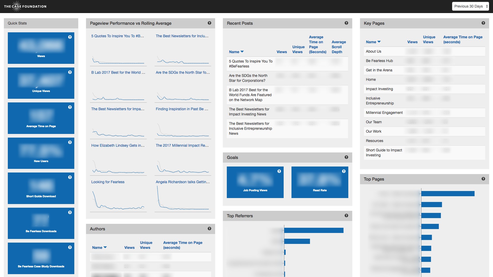

# Analytics Dashboard

(Demo data shown)

## About

Data-informed decision making within an organization is only as good as the organization’s understanding of the data and the timeliness of that information. Faced with that challenge at the Case Foundation, the team responsible for digital analytics and reporting set out to construct a dashboard in that directly communicated key online data to the entire organization in an efficient and easy-to-use experience. This dashboard leverages multiple, more complex analytics services to provide one clear picture of the Case Foundation’s digital performance on multiple website it runs. 

Using this tool, project and program leaders can see real time performance on key communications tools like top blog authors within the organization, page views, time on page, new users, downloads, top performing pages and posts, email campaign performance. To start, we've built the dashboard to interact with our RSS feed, Google Analytics, and Mailchimp, and we plan to eventually expand the dashboard's functionality to also pull in data from other tools we use such as Simply Measured, Clicky and Woopra.

Jump to the [Quick Setup](doc/Setup.md#data-source-quick-setup) to get started.

## Setup

See [Setup](doc/Setup.md)

## Development

See [Development](doc/Development.md)

## Contributing

See [Contributing](Contributing.md) for additional information.

## License

See [License](License.txt) for additional information.

## To Do:

We're actively seeking contributors to this project. Please reach out if you are interested in building any of the new features listed below or have an idea for your own unique contribution.

1. Simply measured datasource
1. Clicky datasource
1. Woopra datasource
1. Scrolldepth datasource

---

Are you using part or all of this code we've shared? We'd love to hear about it! Email us at [opensource@casefoundation.org](mailto:opensource@casefoundation.org) and tell us about how you're using this open source project.
